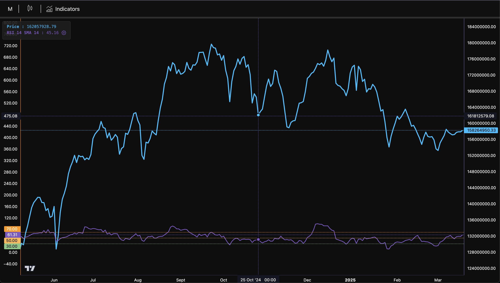

# TradingView-Style Multi-Chart with RSI Indicators

A powerful, customizable TradingView-style chart implementation built with React, TypeScript, and lightweight-charts. This project features real-time RSI indicators, customizable settings, and a modern, responsive UI.



## Features

- 📊 **Multiple Chart Types**
  - Line charts
  - Candlestick charts
  - Customizable time intervals

- 📈 **RSI Indicator**
  - Real-time RSI calculations
  - Customizable parameters
  - Visual limit lines
  - Interactive settings

- 🎨 **Customizable Styling**
  - Plot line styles (solid/dashed)
  - Custom colors for indicators
  - Limit line visibility
  - Dark theme support

- 🖱️ **Interactive Features**
  - Crosshair with hover values
  - Quick access to indicator settings
  - Responsive design
  - Smooth animations

## Tech Stack

- React 18
- TypeScript
- Vite
- lightweight-charts
- Tailwind CSS (optional)

## Getting Started

### Prerequisites

- Node.js (v16 or higher)
- npm or yarn

### Installation

1. Clone the repository:
```bash
git clone https://github.com/yourusername/tradingview-multichart.git
cd tradingview-multichart
```

2. Install dependencies:
```bash
yarn install
# or
npm install
```

3. Start the development server:
```bash
yarn dev
# or
npm run dev
```

## Usage

### Basic Chart Setup

```tsx
import TestChart from './components/TestChart';

const App = () => {
  const navData = [...]; // Your candlestick data
  const lineData = [...]; // Your line chart data
  const indicatorsData = {
    rsi: [...], // Your RSI data
  };
  
  const selectedIndicators = [
    {
      id: 'rsi',
      label: 'RSI',
      settings: {
        // Optional custom settings
      }
    }
  ];

  return (
    <TestChart
      navData={navData}
      lineData={lineData}
      indicatorsData={indicatorsData}
      selectedIndicators={selectedIndicators}
      chartType="candlestick"
    />
  );
};
```

### Customizing Indicator Settings

The chart supports various customization options for RSI indicators:

```typescript
interface IndicatorSettings {
  plot: {
    color: string;
    lineStyle: 'solid' | 'dashed';
    visible: boolean;
  };
  upperLimit: {
    value: number;
    color: string;
    visible: boolean;
  };
  middleLimit: {
    value: number;
    color: string;
    visible: boolean;
  };
  lowerLimit: {
    value: number;
    color: string;
    visible: boolean;
  };
}
```

## Performance Optimizations

- Memoized chart components and callbacks
- Efficient state management
- Optimized re-renders
- Proper cleanup of chart instances

## Contributing

Contributions are welcome! Please feel free to submit a Pull Request.

## License

This project is licensed under the MIT License - see the [LICENSE](LICENSE) file for details.

## Acknowledgments

- [lightweight-charts](https://github.com/tradingview/lightweight-charts) for the charting library
- [TradingView](https://www.tradingview.com/) for inspiration
